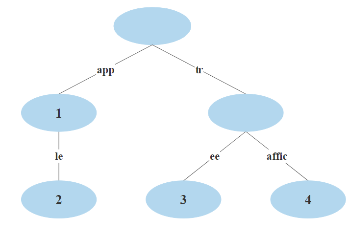

# Autocomplete Search System (VK internship)

## Постановка задачи

Нужно реализовать систему автоматического дополнения запросов для поисковой системы. Она должна на введённый пользователем запрос
возвращать не более 5 наилучших подсказок.

Система инициализируется списком фраз на естественном языке, это может быть что угодно, например,
лог запросов, заголовки фильмов, названия товаров.

Кроме текста фраз инициализацию можно обогащать дополнительной информацией, например, количеством упоминаний этой фразы,
рейтингом фильма, ценой товара и так далее.

## Идея решения

Очевидно, что делать полный перебор асимптотически неэффективно и ресурсозатратно, соответственно, лучше создать индекс позволяющий производить быстрый поиск необходимой информации.

Данное решение основано на префиксном дереве с оптимизацией памяти ([radix tree](https://en.wikipedia.org/wiki/Radix_tree)).
Поскольку задача базируется на изначальном списке поисковых запросов, фильмов, книг и т.д. (в коде для подобных сущностей используется имя content)
дерево формируется на словах из контента. В каждой вершине дерева будет храниться весь контент,
который содержит слово соответствующее вершине (переходы по ребрам не учитывают регистр слов).

Предложенный индекс можно быстро и эффективно обходить сразу "обрезая" вершины не соответствующие искомому слову.
Более того, данный обход можно производить по [автомату](https://en.wikipedia.org/wiki/Automata_theory), позволяющему выявить слова введенные пользователем с опечаткой.

Ниже приведен пример индекса основанного на контенте "Apple", "Apple tree", "Traffic", "App".



В данном случае в вершине 1 будет храниться контент "App", в вершине 2 - "Apple" и "Apple tree", 3 - "Apple tree", 4 - "Traffic".  

Тогда поиск будем производить следующим образом:
* Разобьем запрос пользователя на слова
* Для каждого слова найдем множество запросов, в которых каждый элемент содержит это слово или слово близкое к нему по [расстоянию Левенштейна](https://en.wikipedia.org/wiki/Levenshtein_distance)
* Ответ получаем путем объединения этих множеств и упорядочиванием элементов по релевантности в результирующем множестве

Поиск результатов для слова будем осуществлять путем обхода дерева, до выполнения одного из двух условий:
1. Разница расстояния от слова до слова, соответствующего вершине является критической, тогда возвращаемся в предка
2. Слово в вершине удовлетворяет паттерну - берем весь контент содержащийся в поддереве и упорядочиваем по функции (`f(content) = g(automata) * content.relevance`), где `g(automata)` - процентное совпадение слова в вершине и искомого слова

## Реализация

Код можно разбить на 3 основных компонента:
* [automata](https://github.com/priamoryki/Autocomplete-Search-System-VK/tree/main/src/search/autocomplete/automata) - пакет реализующий автоматы для поиска
* [index](https://github.com/priamoryki/Autocomplete-Search-System-VK/tree/main/src/search/autocomplete/index) - пакет реализующий структуру индекса (префиксное дерево) и поиск в нем
* [content](https://github.com/priamoryki/Autocomplete-Search-System-VK/tree/main/src/search/content) - пакет для упорядочивания всего контента по релевантности (кол-ву запросов, рейтингу и т.д.)

Так же реализован простой [пример](https://github.com/priamoryki/Autocomplete-Search-System-VK/blob/main/src/Main.java) использования DataIndex, который парсит заголовки фильмов из файла и записывает их.  

Замечание: Реализация не поддерживает многопоточный запуск, в том случае когда это необходимо требуется добавить mutex на запись и чтение.

### Примеры запросов с ответами:
```
Enter your query: Romeo
Suggestions to your query: 
1) Romeo and Juliet
2) Julieta y Romeo
3) Romeo is Bleeding
4) Romeo und Julia im Schnee
5) William Shakespeare's Romeo and Juliet
```

```
Enter your query: Romeo Juliet
Suggestions to your query: 
1) Romeo and Juliet
2) William Shakespeare's Romeo and Juliet
```

### Пример запроса с опечаткой:
```
Enter your query: Julie
Suggestions to your query: 
1) Romeo and Juliet
2) Julius Ceasar
3) Celine and Julie Go Boating
4) Julie
5) Miss Julie
```

Необходимо отметить, что, например, "Miss Julie" по приоритету идет выше "William Shakespeare's Romeo and Juliet", поскольку имеет наибольшее совпадение по буквам с изначальным запросом.
Однако, если изменить приоритет добавив в индекс еще несколько запросов "William Shakespeare's Romeo and Juliet" результат поиска существенно поменяется:
```
Enter your query: Julie
Suggestions to your query: 
1) Romeo and Juliet
2) William Shakespeare's Romeo and Juliet
3) Julius Ceasar
4) Celine and Julie Go Boating
5) Julie
```
